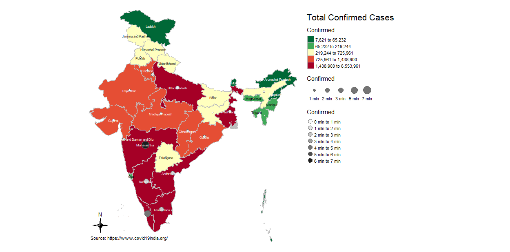

# COVID-19 India Map

I have made a statc and a interective map of India to visualize COVID-19 confirmed cases in India state wise as of 1st october 2021.

# Quick Description

- Map made with package `tmap`
- `tmap` is very handy for making thematic maps in `r`

# File Description
* **India_State_Shapefile** :- Contains the shape file of India.
* **Code rmarkdown** :- Contains the Rmd file of R Code
* **Code-rmarkdown** :- Contains the HTML file of Maps
* **states** :- Contains the COVID-19 India data
* **Images** :- Contains screenshot of maps

# Data Source
## Website
[https://www.covid19india.org/](https://www.covid19india.org/)

## Data Download Link
[https://data.covid19india.org/csv/latest/states.csv](https://data.covid19india.org/csv/latest/states.csv)

# Screenshots

# Environment
I have made this project with following environment:-

**`RStudio Version 1.4.1717`**

**`R 4.1.1`**

